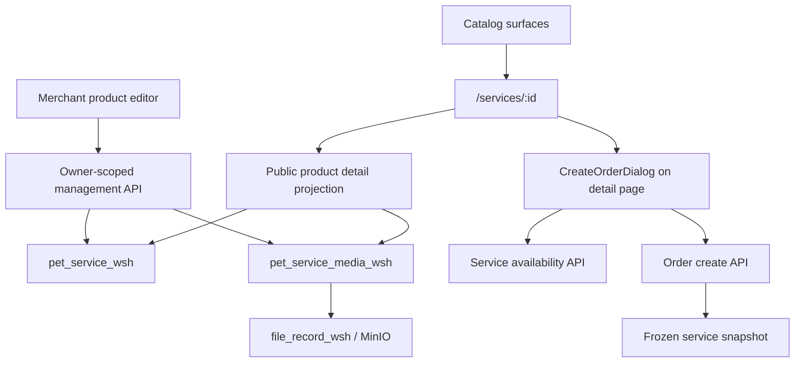
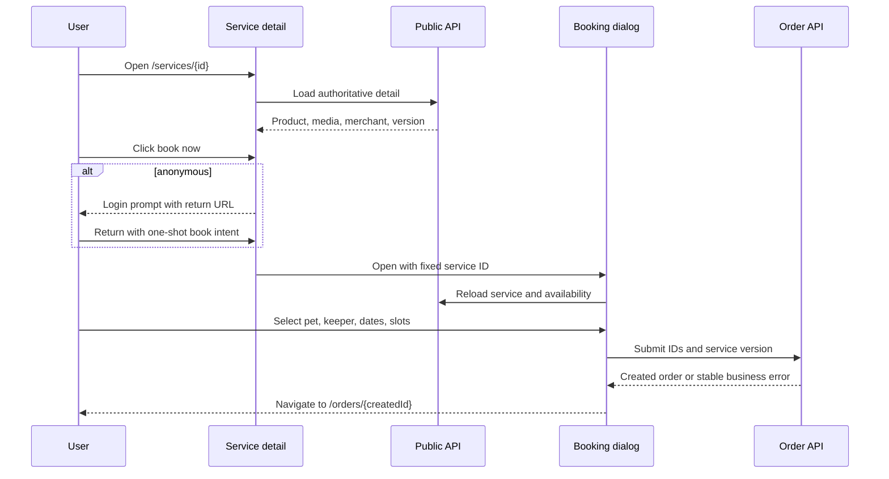
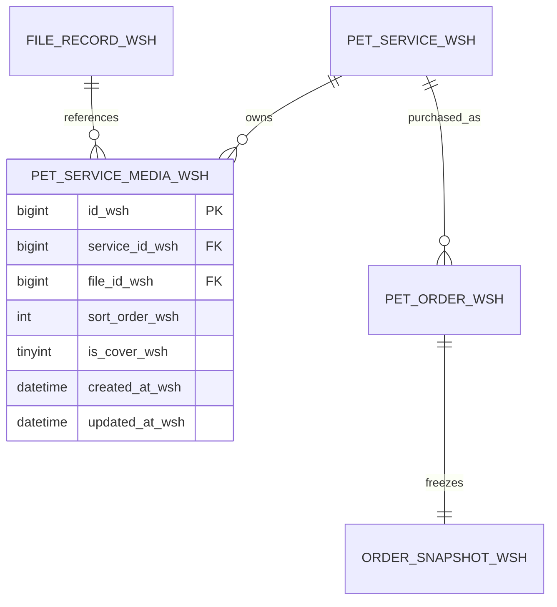
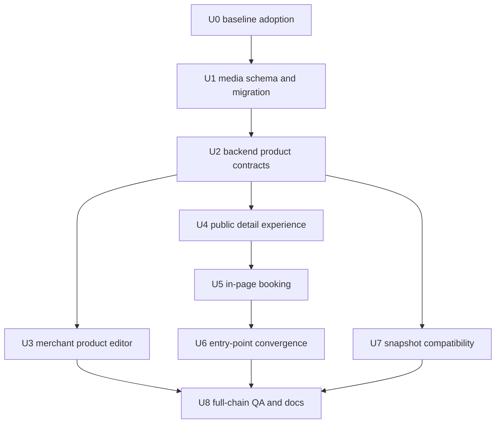

# Service Product Detail and In-Page Booking - Plan

## Goal Capsule

- **Objective:** Make every merchant service a first-class product with a durable public detail page, structured multi-image content, merchant-managed data, and an in-page booking dialog.
- **Authority:** `pet_service_wsh.id_wsh` selects the product; the backend derives merchant, current price, category, availability, and allowed keepers from that service.
- **Execution profile:** Deliver in dependency order. Before each unit commit, run that unit's focused and affected regression gates from the test plan; reserve the complete regression and browser matrix for U8 and final release acceptance.
- **Stop conditions:** Do not ship if public detail can expose disabled/unapproved data, a merchant can edit another merchant's product, old order history changes after product edits, or any service entry point bypasses the detail page.
- **Tail ownership:** Update schemas, Swagger annotations, database documentation, user workflow documentation, automated tests, browser evidence, and the final verification report in the same delivery.

---

## Product Contract

### Summary

Each `pet_service_wsh` record is a distinct sellable product published by one merchant. A user selects a product from any catalog surface, lands on `/services/:id`, reviews its images and details, and opens the booking selector without leaving that page. Merchants can create and later enrich products with a name, platform category, introduction, price/unit, ordered images, cover image, and listing state.

### Problem Frame

The repository already has a public service route and a partial `ServiceDetail.vue`, but booking entry points still commonly navigate to `/orders?create=true...`, where `Orders.vue` opens a dialog. The product therefore still feels merchant/order centered instead of product centered. Product media is stored as a comma-separated string, which cannot safely represent image order, cover semantics, duplicates, or future metadata. Public detail lookup also reuses an internal `getById` path and does not itself guarantee that the service is enabled and its merchant/category remain publicly visible.

The current working tree contains an uncommitted implementation of the preceding service-driven booking plan. That work already introduces service-based pricing, availability, version checks, public list enrichment, and multi-target ratings. It is a prerequisite baseline, not work to overwrite. The executor must inspect and preserve it before applying this plan.

### Actors

- A1. Anonymous visitor views public product details and is asked to sign in only when starting a booking.
- A2. Authenticated pet owner reviews a product and completes the booking selection in the detail page.
- A3. Merchant owner creates, edits, publishes, unpublishes, and manages media for only their own products.
- A4. Administrator can manage any merchant product through the existing authorization model.

### Requirements

**Catalog and navigation**

- R1. Outside `/services/{serviceId}`, every visible product card or product-level booking action must navigate to that product detail and must not open or route directly to order creation. The detail-page action follows R5.
- R2. The detail route must remain public and have explicit loading, not-found, unavailable, error, and retry states.
- R3. A product detail must show product name, category, introduction, current price/unit, ordered gallery, merchant summary, eligible keeper summary, rating summary/list, and booking availability messaging from APIs.
- R4. Direct navigation, refresh, browser back/forward, and sharing a detail URL must preserve the selected product without relying on route-supplied name, merchant, or price.

**Booking experience**

- R5. For a currently supported `day`/`天` product, clicking `立即预约` on its detail opens `CreateOrderDialog` on that same page with the service fixed and authoritative data reloaded by service ID. Other units still have complete detail pages but return `bookable_wsh=false` with `UNSUPPORTED_SERVICE_UNIT`, show a disabled booking action and never enter the day-based order flow in this release.
- R6. Anonymous users stay on the product detail, see the existing login prompt, and return to that exact detail with a one-shot booking intent that opens the dialog after successful login and profile checks.
- R7. A successful booking closes the dialog and navigates to the created order detail; canceling or failing preserves the product detail context.
- R8. The order page remains an order-management page; its generic `创建订单` entry and `create=true` route-query protocol are removed after all product entry points migrate.

**Merchant product management**

- R9. Merchants can create and update product name, enabled category, introduction, price, supported unit, ordered images, cover image, and listing status with server-side validation.
- R10. Product images are stored as structured child records that reference product-purpose MinIO file records, support stable order and one cover image, and never accept or publicly render arbitrary external URLs.
- R11. Product and media replacement is transactional and serialized at the aggregate root. This release never physically deletes MinIO objects during product/media replacement; object garbage collection is deferred until a central reference registry and retention policy cover every current, legacy, and historical consumer.
- R12. A merchant cannot create for another merchant or read/update/delete another merchant's management data; administrators retain existing override behavior.

**Data integrity and compatibility**

- R13. Existing comma-separated `images_wsh` data is migrated idempotently into structured media records in original order, with the first valid internally owned image as cover. The compatibility read path is limited to values that resolve to the configured MinIO origin and an existing file record; unresolved/external values are audit-only and never appear in public media responses.
- R14. Public APIs return only enabled products owned by approved merchants and assigned to enabled categories; management APIs may return disabled products to their authorized owner/admin.
- R15. Order price and service/merchant/keeper identity remain backend derived. The product booking request requires service ID/version; merchant ID is removed from the new request contract or accepted only during a documented compatibility window to reject mismatches, never as lookup authority. Order snapshots preserve the purchased product name, category, introduction, price/unit, version, and ordered media as they existed at booking time.
- R16. Existing service-driven pricing, future-booking policy, availability, coupon, membership, payment, refund, fulfillment, rating, MQ, and SSE behavior must not regress.

**Quality and delivery**

- R17. Each implementation unit must add its own automated tests and pass its focused gate before the next unit begins.
- R18. Final acceptance requires backend and frontend suites, production build, MySQL migration replay, API authorization checks, and Playwright desktop/mobile flows with isolated test data.
- R19. All new database, entity, DTO/VO, request, and response fields follow the repository `_wsh` suffix rule.
- R20. Each completed unit is committed separately after its focused and affected regression gates pass; unrelated pre-existing changes are never staged blindly.

### Key Flows

- F1. Product discovery to booking
  - **Trigger:** A1 or A2 clicks a product card or `立即预约` on any service catalog surface.
  - **Steps:** Navigate to detail, load public product projection, review gallery/content, open in-page booking dialog, authenticate/profile-check if required, choose booking data, submit, then open created order detail.
  - **Outcome:** The created order references exactly the product displayed and uses backend-derived commercial data.
- F2. Merchant creates or enriches a product
  - **Trigger:** A3 opens `/merchant/services` and creates or edits a product.
  - **Steps:** Upload images through the server-owned product-media purpose, validate and arrange file IDs/cover, then submit one aggregate command that saves product fields plus media atomically before previewing the public detail.
  - **Outcome:** Public users see the new version only when the product, category, and merchant are all public.
- F3. Existing image migration
  - **Trigger:** The production migration runs against rows with legacy `images_wsh` values.
  - **Steps:** Parse in order, discard blanks, resolve only owned `file_record_wsh` objects, insert missing media rows, assign a single cover, rerun safely.
  - **Outcome:** No duplicate media rows, no lost valid images, and a documented audit list for unresolved legacy URLs.

### Acceptance Examples

- AE1. Given two merchants publish products with the same name and category, when a user opens each URL, then merchant, price, gallery, booking dialog, order, and snapshot remain tied to the selected service ID.
- AE2. Given an anonymous visitor is on `/services/110`, when they click `立即预约` and log in, then they return to `/services/110` and the dialog opens once without navigating through `/orders`.
- AE3. Given a merchant changes a product name, cover, introduction, and price after an order is created, when the owner views that historical order, then the order snapshot still shows the purchased version.
- AE4. Given an unapproved merchant, disabled category, or disabled/deleted product, when a public caller requests the detail, then the API returns a stable unavailable/not-found response without leaking management data.
- AE5. Given merchant M1 sends product or media mutations for M2, when the API receives the request, then it returns 403 and makes no database or MinIO reference changes.
- AE6. Given the legacy media migration runs twice, when rows are compared, then service/media/order relationships and cover counts are unchanged after the second run.

### Success Criteria

- No product-level booking action in `frontend/src` routes to `/orders?create=true`.
- Product detail and booking work at 1280x720 and 390x844 without overlap, unreachable controls, or horizontal page scrolling.
- Exactly zero order requests accept merchant or price as authority; changed product versions are handled by the existing `PRICE_CHANGED` refresh path.
- Structured media supports 0 to 10 images, unique contiguous sort order, and exactly one cover when at least one image exists; concurrent aggregate updates result in one complete winning version, never a mixed gallery.
- All R18 gates pass with an isolated Playwright fixture that can be rerun without manual database deletion.

### Scope Boundaries

**In scope**

- Public product detail API/projection, structured media persistence, merchant product editor, in-page booking orchestration, entry-point migration, order snapshot media, migrations, documentation, and tests.

**Deferred to follow-up work**

- Rich-text/WYSIWYG introductions, video media, per-variant pricing, add-ons, stock calendars per product, SEO server rendering, recommendations, and image transformation/CDN variants.

**Outside this product's identity**

- A generic marketplace SKU/warehouse/inventory system and client-calculated pricing.

---

## Planning Contract

### Current Repository Findings

- `frontend/src/router/index.js` already exposes public `/services/:id`.
- `frontend/src/views/user/ServiceDetail.vue` loads service, merchant, keepers, and ratings, but uses only the first comma-separated image and routes booking to `/orders`.
- `frontend/src/components/dashboard/ServiceGrid.vue`, `frontend/src/views/user/Dashboard.vue`, `frontend/src/views/user/MerchantDetail.vue`, `frontend/src/views/user/KeeperDetail.vue`, and `frontend/src/views/user/Keepers.vue` contain direct order-query entry points.
- `frontend/src/views/user/Orders.vue` owns `CreateOrderDialog` and a generic create button, coupling catalog selection to order management.
- `frontend/src/views/merchant/MerchantServices.vue` supports name/category/description/price/unit and multiple uploads, but serializes media into `images_wsh` and has no ordering or cover control.
- `pet-business/.../ServiceItemController#getById` currently returns the internal entity projection without enforcing public visibility.
- `pet-business/.../ServiceItemServiceImpl` validates ownership in the controller, stores arbitrary image strings, and maps detail DTOs with per-record category lookup.
- `FileController` records authenticated MinIO uploads in `file_record_wsh`, which provides a stable media reference and owner for the new child table.
- Current baseline on 2026-08-12: Maven `121/121` passed, Vitest `69/69` passed, and Vite build passed. Playwright was `2/3`; the positive case was not replayable because fixed pet `109` already had active order `141` for 2026-08-13 through 2026-08-14.

### Key Technical Decisions

- KTD1. Keep `pet_service_wsh` as the product aggregate root. A second product table would duplicate ownership, pricing, status, favorites, ratings, availability, and order references.
- KTD2. Add `pet_service_media_wsh` instead of extending comma-separated JSON/text. A child table gives referential integrity, deterministic order, cover uniqueness validation, ownership checks, and future metadata without string parsing.
- KTD3. Reference `file_record_wsh.id_wsh` from product media. Public media URLs are derived at response time from a server-configured trusted origin or private-bucket delivery path; create/update APIs accept file IDs plus order/cover state, not arbitrary URLs. Snapshots retain object-key presentation metadata rather than expiring signed URLs.
- KTD4. Return separate list-summary and detail projections. List queries stay bounded, while detail may include full ordered media and merchant/category summaries without bloating every catalog response.
- KTD5. Treat public visibility as one shared service-layer invariant. Every anonymous service surface, including legacy `GET /api/services/{id}`, detail, list, merchant/category lists, and availability, must delegate to the same enabled-service, approved-merchant, enabled-category, logical-delete check; management paths remain owner/admin scoped.
- KTD6. Mount the existing `CreateOrderDialog` in `ServiceDetail.vue`. Reuse its availability, profile, coupon, pricing display, double-submit, and error handling rather than creating a second booking form.
- KTD7. Represent login resume as a return URL plus a one-shot `book=1` intent on the detail route. Product ID remains in the path, the intent is cleared after opening, and no name/price/merchant data travels through query parameters.
- KTD8. Snapshot media as immutable ordered URL/object-key metadata inside `service_snapshot_wsh`, not live file IDs; historical order rendering must never join current product/media rows.
- KTD9. Migrate legacy media with audit-first rules. Only values that normalize to the configured MinIO origin and resolve to existing file records become structured rows or temporary public fallback. External, protocol-relative, data, and malformed URLs remain only in an audit/remediation view and are never rendered publicly.
- KTD10. Treat `天` and canonical `day` as the only booking-capable units in this phase. Other products get full detail and management but a stable `UNSUPPORTED_SERVICE_UNIT` reason; unit-aware session/hour booking is a follow-up because the current order, price, availability, fulfillment, and snapshot model is day-based.

### High-Level Technical Design

The following sketches are directional guidance, not implementation specifications.

### API Contract

**Public detail**

`GET /api/services/{serviceId}/detail` returns a `ServiceProductDetailVO` containing the existing product fields plus `media_wsh[]`, category summary, rating summary, `service_version_wsh`, and `bookable_wsh`/reason. It uses dedicated allowlisted `PublicMerchantSummaryVO` and `PublicKeeperSummaryVO` values: public identifiers, display name, avatar/cover, coarse city/district, public rating/count and display specialties only. It excludes user IDs, phones, exact address/coordinates, license/certificate documents, internal status/workflow fields, capacity internals, leave reasons, object credentials, and other users' data. It returns a stable 404/unavailable code for any record that fails the shared public-visibility invariant.

The existing anonymous `GET /api/services/{id}`, availability route, merchant/category product lists, and any other public service lookup must delegate to the same visibility-safe service method or become authenticated management-only after all callers migrate. No shadow endpoint may expose a disabled/deleted service, unapproved merchant, or disabled category.

**Management detail and mutations**

- `GET /api/services/{serviceId}/manage` is owner/admin only and returns editable fields plus ordered media.
- `POST /api/services` and `PUT /api/services/{id}` are aggregate commands containing validated scalar product data plus ordered `media_wsh[]` entries (`file_id_wsh`, `sort_order_wsh`, `is_cover_wsh`). One backend transaction saves the service and complete media set; merchant identity is derived for merchant callers and accepted only as an explicit admin operation.
- Aggregate update locks the parent `pet_service_wsh` row (`SELECT ... FOR UPDATE`) or uses an equivalent checked aggregate-version update before replacing media. It validates file ownership/purpose, detected image type, maximum count, distinct file IDs, contiguous order, and exactly one cover when non-empty. Concurrent updates end with one coherent aggregate version.
- `PUT /api/services/{id}/media` may remain only as a later gallery-only aggregate command with the same authorization, lock/version and validation rules; the create/edit form does not split one save across scalar and media mutations.
- Product images upload through a server-owned product-media endpoint/purpose. The server records product purpose and target merchant scope on the file record, ignores caller-selected directories, caps bytes and decoded dimensions, verifies magic bytes plus successful decode, allows raster formats only, rejects SVG/HTML/polyglots/truncated content, and derives extension/content type. Merchant uploads are scoped to their merchant; an admin upload must explicitly target one merchant and cannot attach arbitrary users' files. If object upload succeeds but file-record creation fails, the just-created object is removed by that request's compensating action.
- The legacy `images_wsh` response remains compatible only for an explicitly measured rollout exit criterion: production audit has zero unresolved internally hosted rows and all supported clients consume `media_wsh`. It is deprecated in Swagger, excluded from new writes, and never returns unresolved external values.

**Order creation**

The product booking contract requires `service_id_wsh` and `service_version_wsh`. The order service loads the public/bookable service first, derives merchant and price, then validates keeper membership/eligibility. `merchant_id_wsh` is removed from the new client payload; if kept for one compatibility window, it is optional, mismatches reject, and it is never used to select the merchant. Swagger, dialog payloads, and negative tests must match this contract.

### Data and Migration Contract

- Create `pet_service_media_wsh` in MySQL baseline, H2 schema, and a dedicated versioned incremental script such as `pet-admin/src/main/resources/db/migration_v6_service_product_media.sql`.
- Enforce uniqueness for `(service_id_wsh, file_id_wsh)` and `(service_id_wsh, sort_order_wsh)`; enforce one cover in the service transaction because MySQL/H2 portable partial unique indexes are not available in the same shape.
- Index `service_id_wsh` and `file_id_wsh`, add foreign keys where existing schema policy permits, and retain logical ownership through the aggregate.
- The versioned script has an idempotent migration-ledger guard, asserts the target schema/environment, emits inserted/skipped/unresolved counts, and is an explicit CI/CD/operator release step because application startup does not automatically run these standalone SQL files. Deployment fails its readiness check when the expected migration version is absent.
- Migration parses legacy `images_wsh` in source order and joins normalized configured-MinIO URLs/object names to `file_record_wsh`. It must not invent file records or import remote URLs. It runs twice against a temporary MySQL schema with identical invariants, then the same recorded command is used in release.
- After backfill, the read projection prefers structured rows and falls back only to internally hosted legacy values that resolve to an existing file record. Unresolved/external values are audit-only. Removal of the fallback and old column is a later migration after the stated zero-unresolved/client-adoption exit criterion.
- Product deletion remains logical. Referenced orders and snapshots remain valid; structured media rows are not used to reconstruct history.

**Deployment order:** (1) apply and record the backward-compatible table/file-purpose migration; (2) deploy code that dual-reads structured media then trusted legacy fallback, writes only the aggregate contract, and checks migration readiness; (3) run idempotent backfill/audit; (4) migrate all clients and reach zero unresolved internal rows; (5) remove fallback/old column only in a separately approved later release. Each deployable step remains compatible with the immediately preceding application/schema version or has an explicit maintenance-window requirement.

### Assumptions

- A maximum of 10 product images is sufficient for this phase.
- Product introduction remains plain text and is rendered escaped; HTML input is rejected or treated as text.
- Canonical booking units are `day` and the existing Chinese value `天`, normalized to one internal day semantic. Existing `次`, `课时`, `小时` and unknown values remain manageable and visible but return `UNSUPPORTED_SERVICE_UNIT`; this release does not reinterpret them as days.
- The current uncommitted service-driven booking changes are intended prerequisites. The executor must verify them and create a clearly scoped prerequisite commit before overlapping files are changed, or leave unrelated hunks unstaged if they are not part of the accepted baseline.

### Risks and Mitigations

- **Dirty prerequisite baseline:** Overlapping files can make commits misattribute earlier work. Inventory the diff, rerun its documented gates, and isolate a prerequisite commit before U1.
- **Public data leak:** Internal `getById` currently exposes disabled rows. Add a dedicated public query and negative authorization/visibility tests before UI work.
- **MinIO safety:** The upload request may compensate only its own object when file-record creation fails. Product/media edits retain file records and objects even after detachment; no general physical deletion runs until a central, concurrency-safe reference registry and retention policy cover avatars, evidence, legacy URL fields, and immutable snapshots.
- **Upload abuse:** A generic directory/MIME-trusting upload is insufficient for public product images. Use a server-owned product-media purpose with byte/dimension caps, content detection/decoding and raster allowlisting before a file can be attached.
- **Snapshot drift:** Current order UI could join live service data. Add a characterization test before expanding snapshots and verify historical rendering after edits/deletion.
- **Migration ambiguity:** Legacy URLs may not map to `file_record_wsh`. Produce counts and unresolved samples, preserve fallback, and do not silently drop them.
- **E2E pollution:** Existing specs use fixed pet/date rows. Provision unique fixtures per run and clean them through test-owned APIs/SQL in `afterEach`.
- **Bundle size:** Current build reports an approximately 1.65 MB main chunk. Keep detail/gallery/dialog code route-local and avoid adding a new gallery dependency unless measurements justify it.

### Sequencing

---

## Implementation Units

### U0. Adopt and freeze the prerequisite baseline

- **Goal:** Turn the current service-driven booking working tree into a verified, reviewable prerequisite without losing user changes.
- **Requirements:** R15, R16, R20.
- **Files:** Existing modified/untracked files listed by `git status`; `docs/2026-08-11-service-driven-booking-verification-report.md` as evidence.
- **Approach:** Compare the diff to the 2026-08-11 plan, run the focused and affected non-destructive gates below, identify unrelated hunks, and create one prerequisite commit only for verified intended work. Do not reset, overwrite, stage unknown changes, delete shared database rows, or include the unexplained untracked file `135` without proving its ownership and purpose.
- **Test scenarios:** Service price overrides keeper price; service version mismatch rejects; cross-merchant keeper rejects; availability remains read-only; three rating dimensions remain unique; future booking while currently closed remains valid.
- **Verification:** Maven business suite, frontend Vitest, production build, and the isolated subset of existing browser tests that does not mutate conflicting fixed fixtures.

### U1. Add structured product media persistence and idempotent migration

- **Goal:** Establish ordered, cover-aware, MinIO-backed media without losing legacy images.
- **Requirements:** R10, R11, R13, R19.
- **Files:** `database/00_database_unified.sql`, `database/01_database_baseline.sql`, `pet-admin/src/main/resources/h2-schema.sql`, a new versioned script under `pet-admin/src/main/resources/db/`, media and product-purpose upload entity/mapper/service/DTO/controller files under `pet-business/src/main/java/com/pet/`, migration readiness code/config, and `docs/database/tables-description.md`.
- **Patterns:** Follow `file_record_wsh`, MyBatis-Plus entities/mappers, `_wsh` naming, and existing idempotent migration guards.
- **Approach:** Create media rows by product-purpose file ID, lock/version the aggregate before replacement, validate invariants transactionally, backfill only resolvable internal legacy values, expose unresolved values only for authorized remediation, and deliver the versioned operator/CI migration plus ledger/readiness check. Retain detached objects in this release.
- **Test scenarios:** Empty gallery; one image becomes cover; ten ordered images; duplicate file/order rejected; two covers rejected; concurrent replacements yield one complete set; spoofed MIME/SVG/HTML/polyglot/oversize dimensions/truncated image/path-like upload directory rejected; upload-record failure compensates its own object; foreign user file rejected; migration order preservation; blanks/duplicates; external URL audit-only; two migration runs produce identical rows; expected migration version absent fails readiness.
- **Verification:** New schema/service tests on H2, migration replay against a temporary MySQL schema, then Maven business regression.

### U2. Harden public and management product APIs

- **Goal:** Provide authoritative detail/manage projections and secure product/media mutations.
- **Requirements:** R2, R3, R9, R12, R14, R15, R19.
- **Files:** `ServiceItemController`, `ServiceItemService`, `ServiceItemServiceImpl`, service DTO/request/VO classes, media services, `SecurityConfig`, and focused backend tests under `pet-business/src/test/java/com/pet/boarding/`.
- **Patterns:** Reuse batch enrichment from the current public list query, controller `@PreAuthorize`, merchant ownership checks, stable `BusinessException` codes, and SpringDoc annotations.
- **Approach:** Inventory every anonymous service endpoint and route all of them through one public-visibility invariant; make old detail paths delegate safely or management-only. Use allowlisted public summary DTOs, aggregate product mutations, derived merchant identity, strict scalar/category/media validation, and a service-first order-create contract that derives merchant and price.
- **Test scenarios:** Public visible detail; disabled service/category and unapproved merchant hidden through detail, legacy ID, list and availability paths; nonexistent ID; anonymous response field allowlist; owner/admin manage success; other merchant 403 on aggregate read/write/delete; missing/forged/mismatched order merchant input; blank/oversize name/introduction; price scale/extremes; non-positive IDs; supported day aliases and unsupported units; invalid category/status; external/data/protocol-relative URL rejected from public output; no N+1 media/category/merchant query pattern.
- **Verification:** Focused controller/service tests, generated OpenAPI inspection, then Maven business and admin module tests.

### U3. Rebuild merchant product management around the product contract

- **Goal:** Let merchants create and enrich products with a usable ordered gallery and preview.
- **Requirements:** R9, R10, R12, R19.
- **Files:** `frontend/src/views/merchant/MerchantServices.vue`, `frontend/src/api/service.js`, `frontend/src/api/file.js`, new focused component tests, and small reusable media helpers/components only if they remove real duplication.
- **Patterns:** Existing merchant layout, Element Plus icons, MinIO upload API, category store, and current 8px-or-less card/dialog styling.
- **Approach:** Use file IDs returned from uploads, draggable or explicit move controls for deterministic ordering, a cover selector, upload progress/errors, validation summaries, unsaved-change protection, and public preview.
- **Test scenarios:** Create minimal product; edit every field; upload multiple images; reorder; choose cover; remove image; retry partial upload failure; reject wrong MIME/too many files; preserve form on save failure; disable controls while saving; owner cannot submit forged merchant ID; keyboard operation and mobile layout.
- **Verification:** Component tests for form/media behavior, frontend full Vitest, production build, and merchant browser flow on desktop/mobile.

### U4. Complete the public product detail experience

- **Goal:** Make `/services/:id` a complete, resilient, shareable product page.
- **Requirements:** R2, R3, R4, R14.
- **Files:** `frontend/src/views/user/ServiceDetail.vue`, `frontend/src/api/service.js`, new `ServiceDetail.spec.js`, and existing shared media/empty/loading components.
- **Patterns:** `MediaWithFallback`, public route metadata, rating APIs, favorite control, existing design tokens, and accessible native controls.
- **Approach:** Render an ordered gallery with thumbnail selection, merchant/category/price/content, ratings and keeper summaries, sticky booking action on wide screens, compact mobile action, and explicit unavailable/retry states.
- **Test scenarios:** 0/1/10 images; thumbnail and keyboard selection; malformed media fallback; long Chinese product name/introduction; zero price; missing rating; partial merchant/rating failure; 404/unavailable; route ID changes without remount; direct refresh; mobile no-overlap; reduced motion; accessible names/focus.
- **Verification:** Component tests, route-level browser screenshots at 1280x720 and 390x844, console/network error inspection, then frontend regression/build.

### U5. Move booking selection into the product detail page

- **Goal:** Open the existing booking dialog in place and preserve authentication/profile/error semantics.
- **Requirements:** R5, R6, R7, R15, R16.
- **Files:** `ServiceDetail.vue`, `CreateOrderDialog.vue`, their specs, login redirect/app store utilities if required, and `frontend/e2e/service-product-booking.spec.js`.
- **Patterns:** Existing `ensureProfileRequirement`, login prompt, service version refresh, availability sequence guard, and order-created event.
- **Approach:** The page owns dialog visibility; dialog accepts only the fixed service ID as selection intent and reloads authoritative service data. Login return accepts only a normalized same-origin `/services/{positiveId}?book=1` target with no unknown keys, fragments or nested redirects, falling back to `/dashboard`. The intent is removed with route replacement after authentication/profile checks open it once. On create success, route to the returned order ID.
- **Test scenarios:** Logged-in open/cancel/reopen; supported/unsupported unit actions; anonymous login resume; malicious scheme/protocol-relative/encoded/nested redirect rejection; profile requirement failure; service changes before submit; service off-shelf while dialog open; availability stale response; double click submits once; create success routes to order detail; business error keeps selections where safe; focus enters and returns from modal; browser back closes intent predictably.
- **Verification:** Focused detail/dialog tests, frontend suite/build, and isolated Playwright booking flow including API request assertions that price/merchant are not authoritative payload inputs.

### U6. Converge every product entry point on detail-first navigation

- **Goal:** Remove the merchant/order-centered bypasses and leave one booking entry contract.
- **Requirements:** R1, R4, R8.
- **Files:** `ServiceGrid.vue`, `Dashboard.vue`, `MerchantDetail.vue`, keeper views that currently create generic orders, `Orders.vue`, router/query handling, affected specs, and existing `future-booking.spec.js`.
- **Patterns:** `goDetail(serviceId)` and named route navigation.
- **Approach:** Product cards/buttons route to detail. Keeper-only contact flows must first select a product from that keeper's merchant or be relabeled as contact/chat; they must not create a service-less order. Remove the generic create button and query opener from Orders after callers are migrated.
- **Test scenarios:** Every service card/action lands on correct detail ID; merchant service booking lands on detail; dashboard CTA selects detail; keeper page cannot bypass product selection; Orders ignores/removes old create query; browser back returns to the originating catalog/filter context; no route query contains name/price/merchant.
- **Verification:** Static search for legacy query patterns, affected component tests, frontend full suite/build, and Playwright navigation matrix.

### U7. Freeze complete product presentation in order snapshots

- **Goal:** Keep purchased product presentation stable after edits, media changes, unpublish, or logical deletion.
- **Requirements:** R11, R15, R16.
- **Files:** `OrderSnapshotServiceImpl`, snapshot DTO/entity consumers, order detail components, backend snapshot tests, and relevant frontend order detail tests.
- **Patterns:** Existing JSON snapshot construction and snapshot-first order rendering.
- **Approach:** Add ordered media metadata and category/introduction/version fields to the snapshot, then ensure order detail uses snapshot fields before any live fallback for legacy orders.
- **Test scenarios:** Snapshot with no/one/many images; product edit after order; media reorder/removal; product unpublish/delete; legacy order without new snapshot keys; malformed snapshot fallback; no live merchant/media lookup needed for complete new snapshots.
- **Verification:** Backend snapshot characterization/regression tests, frontend order detail tests, and a browser scenario comparing a new order before/after product edit.

### U8. Make the full chain reproducible and document the release

- **Goal:** Produce repeatable proof across MySQL, API, browser, responsive UI, and documentation.
- **Requirements:** R17, R18, R20.
- **Files:** `frontend/playwright.config.cjs`, E2E fixtures/specs, `docs/testing/service-product-detail-booking-test-plan.md`, `docs/功能模块操作流程与使用说明.md`, `docs/database/tables-description.md`, and a dated verification report.
- **Patterns:** Existing Playwright/Vitest/JUnit infrastructure and repository release reports.
- **Approach:** Replace fixed IDs/dates with unique run-owned fixtures, capture response/console failures, clean only run-owned data, execute the full matrix, and document actual commands/results without claiming unrun checks.
- **Test scenarios:** Two merchants with same-name products; anonymous and owner journeys; owner/admin/foreign-merchant management; migration replay; product edit after order; 0/1/10 media; disabled visibility states; desktop/mobile; clean second E2E run.
- **Verification:** Every gate in the Verification Contract passes twice where replayability is required, followed by diff review and a documentation-only final commit if results changed docs.

---

## Verification Contract

The detailed scenario catalog and phase gates are authoritative in `docs/testing/service-product-detail-booking-test-plan.md`.

| Gate | Applies after | Proof |
|---|---|---|
| Focused backend JUnit tests for changed services/controllers | U1, U2, U7 | New scenarios pass with no skipped business assertions |
| `mvn -pl pet-business -am test` | U0, U1, U2, U7, U8 | All reactor tests pass; MySQL-only tests report pass or an explicit environment skip |
| `mvn -pl pet-admin -am test` | U2, U8 | Application/schema/security integration remains green |
| Focused Vitest specs | U3, U4, U5, U6, U7 | Changed component behavior and error states pass |
| Frontend `npm test` | U0 and every frontend unit | All test files and cases pass |
| Frontend `npm run build` | U0 and every frontend unit | Production bundle succeeds; size delta is recorded |
| MySQL migration replay in temporary schema | U1, U8 | First and second run succeed; row counts/cover invariants are stable |
| Playwright merchant management suite | U3 | Aggregate create/edit/media flow passes on desktop/mobile |
| Playwright public detail suite | U4 | Detail states/gallery pass on desktop/mobile with inspected console/network |
| Playwright in-page booking suite | U5 | Supported-unit booking and unsupported-unit state pass |
| Playwright navigation suite | U6 | Every product entry converges on its detail and Orders has no create bypass |
| Playwright snapshot stability suite | U7 | Historical presentation remains frozen after product/media edits |
| Complete combined Playwright suite | U8 | All product/navigation/booking/management flows pass with no unexpected errors |
| Consecutive Playwright rerun | U8 | A second run passes without manual cleanup or fixed-fixture collision |
| Final repository scan | U6, U8 | No product booking path uses `/orders?create=true`, client price, or client merchant authority |

### Baseline Evidence

On 2026-08-12 before this plan was written:

- `mvn -pl pet-business -am test`: 121 tests passed.
- `npm test` in `frontend`: 16 files, 69 tests passed.
- `npm run build` in `frontend`: passed with an existing large main-chunk warning.
- `npx playwright test` in `frontend`: 2 passed, 1 failed because pet `109` already had active order `141` over the fixed dates. No data was deleted to force a pass.

---

## Definition of Done

- All R1-R20 requirements and AE1-AE6 examples are satisfied by code and tests.
- U0-U8 each has a focused test result and a scoped commit; no commit silently absorbs unrelated user changes.
- Public product detail is authoritative, shareable, responsive, accessible, and cannot expose disabled/unapproved data.
- Merchant product management supports validated scalar fields and ordered MinIO-backed media with owner/admin authorization.
- Booking opens on the detail page, login resumes there once, and successful creation routes to the created order detail.
- Legacy order-query entry points, the generic Orders create flow, and the `create=true` protocol are removed.
- Existing media is migrated without silent loss, the migration is replayable, and unresolved records are reported.
- New orders render complete product snapshots after product edits/removal; legacy orders still render safely.
- Backend tests, frontend tests, build, MySQL replay, authorization probes, desktop/mobile Playwright, and consecutive E2E rerun all pass.
- Swagger annotations, database docs, workflow docs, test plan, and final verification report match the shipped behavior.
- Abandoned experiments, unused compatibility code beyond the declared rollout window, debug logging, fixed test data, screenshots not used as evidence, and generated junk are removed before the final commit.
